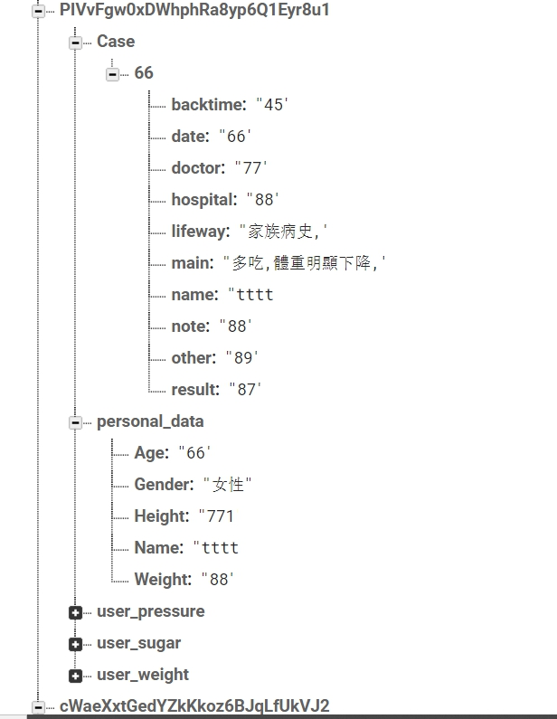
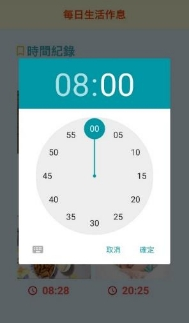

# **專題報告**
**Diabetes Surveillance System**

**指導教授:黃維民 教授**
1. ## **專題之動機**
**【糖尿病名列台灣10大死因第5位】**

`    `而根據台灣衛生福利部國民健康署2014年至2017年的統計，台灣18歲以上糖尿病盛行率高達10.1％，估計全國有超過200萬糖尿病患者，是台灣人不容小覷的病症。原因之一是國人不良的生活型態，讓糖尿病大張旗鼓地橫行。台灣成人肥胖率已高達43％、且近八成的15歲以上國人身體活動不足，罹病危機四伏。

` `據估計，非常多的糖尿病病人罹病而不自知，原因在於糖尿病症狀通常緩慢發生，在開始時往往不易察覺。糖尿病是全身血管系統的殺手，它帶來的慢性合併症包括小血管病變，如視網膜病變、腎臟病變、神經病變；以及大血管病變，又稱動脈硬化症，一旦病情控制不佳，易引起心臟病、中風，還會造成眼睛、腎臟、下肢血管等併發症，甚至造成失明、洗腎和截肢。

` `有許多醫師提醒，只要空腹血糖、飯後血糖或糖化血色素，有任一項指標超過正常值，雖尚未達到罹患糖尿病之標準，但仍屬於「糖尿病前期」的患者。不論是一般民眾或者糖尿病患者，醫師皆建議應該定時掌握自己的血糖狀況，平時在家可以運用血糖機，依據一定的測量次數及時間自行測量血糖，有助於自我警惕，將血糖控制在目標範圍，遠離糖尿病。

。
1. ## **專題之目標**
本專題的主要目標分為四點:

**目標一、有效且有系統地記錄使用者各類數據**

`		`針對不論是一般民眾或者糖尿病患者，協助有效且有系統地記錄血糖、血壓(包含收縮壓與舒張壓)、體重、心跳相關數據。相較於圓餅圖、直方圖等視覺化圖表，我們決定將上述所新增的相關資料繪製成折線圖，如此可以去觀察各項數據是否出現驟降或驟升的異常表現，讓使用者對於自己的健康情況更加清楚明瞭，假如呈現異常現象及趨勢，使用者須多加留意並考慮是否有就醫的需要。

**目標二、建立醫生端與病人端的密切關係**

`	 `醫生端的介面與病人端的完全不同，醫生可以透過其系統開立病歷並儲存一份病歷紀錄(包含病歷編號、病患姓名、看診日期、	看診結果、回診時間、病人情況)在醫生端；傳送另一份紀錄(包含看診日期、醫院名稱、醫師、看診結果、回診時間及注意事項)至病人端，雙方皆可對每次的就醫情況清楚了解，為彼此建立緊密關係。

**目標三、改善運動與飲食習慣，預防和控管糖尿病**

運動:

`    `近年來經濟繁榮，國人吃的豐盛、缺乏運動、體重增加，使得糖尿病患有日漸增加的趨勢，多數糖尿病患者的死亡及罹病都與心血管疾病有關，流行病學的證據顯示，規律運動與強健體能可使一般人的心血管疾病減少，同時也可減少非胰島素依賴型糖尿病的發生。隨著壽命延長，老年人的糖尿病發生率增加，發生糖尿病併發症的人數也增加，因此運動的角色顯得更加重要。運動的好處主要有:改善心肺功能，增進體能、促進體重減輕，維持理想體重、有助於血糖的控制、降低冠狀動脈及心臟病之危險因子、加強病患的自信心及減少心理壓力。

`	 `我們根據衛生福利部國民健康署所提供的多項運動消耗熱量相關數據，只要使用者先選取運動類型(如散步、騎腳踏車、游泳等等)並輸入運動時間及最近體重，即可得出此次運動消耗多少大卡的結果。

飲食:

`    `應攝取足量且均衡的營養，使血糖儘量接近正常值，維持理想體重，達到預防或延緩併發症的發生。因此糖尿病患的飲食照顧應以正常飲食為基礎，即包括六大類食物的均衡飲食，故糖尿病飲食是一種均衡而且健康的飲食，與一般人一樣，只是在選購及烹調方式需以少油、少鹽、無糖、低熱量、高膳食纖維、低GI飲食為主。

` `我們則提供多種高纖食物和低GI飲食給使用者作選擇，高纖食物因含有豐富的膳食纖維，能增加飽足感有助於控制食量；避免腸胃道吸收速率增加，可以延緩血糖上升，幫助穩定血糖。另外膳食纖維也能降低血脂及膽固醇，並且促進腸道蠕動；低GI食物能避免引起血糖不穩定、避免餐後血糖大幅上升，一般來說，富含纖維質的全穀類食物、深綠色蔬菜之GI值相對較低(系統整理出GI值50以下的食物供選擇)。糖尿病患者平常主食除了控制量之外也應盡量選擇低GI的食物，有助於控制血糖和體重，平時多留意各類食物特性，就能吃得更健康。

` `糖尿病患一天的六大類食物要如何分配？其食用量需多少呢？其實「量」是因人而異的，需依其身高、體重、年齡、活動量、飲食習慣及配合藥物，設計一份符合個人需求並可遵循的飲食計劃。我們根據衛福部國民健康署網站裡的「均衡飲食/食物營養與熱量」中的「熱量來源」主題文章，所提供的每日需要多少熱量相關計算方式與數據，只要使用者輸入其身高、體重、每日活動量，即可求出每日應攝取之熱量。

**目標四、當心老人用藥，系統化整理用藥名稱及時段；設置鬧鈴提醒，避免忘記服藥時間**

`	 `老人的用藥問題，向來受人關注，因老人同時患有多種慢性病的比例較高，且同時服用多種藥物及多重處方的現象，相當普遍。據統計，老年人平均患有1.4種慢性病，慢性處方中老年人平均用藥量約是年輕人的5倍以上，與一般人比較，老人家吃錯藥的機率多7倍，服藥發生交互作用的機率，則多出2.5倍。對於老年患者及其照顧者用藥的適當指導，可避免老年患者因身體狀況改變、或溝通不良等因素所導致的藥物副作用與交互作用的產生。 

`    `我們的專題系統則設立「服藥提醒」功能，可以輸入用藥名稱與用藥時段(如早餐餐前、午餐餐後、睡前等)，會彙整成個人的藥物清單，並將右方的按鈕打開，即會立刻跳到手機內建的鬧鐘介面，以利使用者直接進行鬧鈴提醒設定，避免忘記服藥時間。

1. ` `**相關研究**

**3-1糖尿病發展系統現況**

`      `糖尿病本身雖不足以立即致死，但若血糖控制不好，則易因併發症造成死亡。治療之道除醫療團隊的用心照護，更有賴病人自我控制，三軍總醫院利用連續血糖監測系統(Continuous Glucose Monitoring System:CGMS)測得血糖變化資料，調整處方與衛教，有效達到積極控制糖尿病的目標。理想的血糖控制除了在醫院定期抽血測血糖外，仰賴病人在家使用血糖機做自我監測；但血糖機只能反映瞬間的血糖值，無法提供24小時整天的血糖變化，即便糖尿病人願意積極配合測血糖，還是可能無法監控到無感知的低血糖及凌晨時段的黎明現象。

` `CGMS乃是由透過蝴蝶針置入腹部皮下，再外接主體血糖值記錄器。醫療人員將探頭插入患者皮下後，機器就會開始將患者的血糖值，每5分鐘記錄一次，連續72小時記錄。病人佩戴CGMS的三天內，仍須作幾次的自我血糖監測，並將血糖值輸入至血糖紀錄器內；佩戴結束後，再由醫護人員將資料下載至電腦，即可產生這段期間的所有血糖曲線圖，佩戴期間仍需花時間做記錄、量血糖，除此之外還是可以正常的執行日常生活活動。這些血糖變化資訊可使醫護專業人員更有效的提供病人處方的調整和運動、飲食衛教，可增加個案的遵醫囑性，或是方便醫師改變糖尿病的治療策略，達到積極控制糖尿病的目標。另外，除了連續血糖監測系統外，還有守護者即時顯示血糖監測系統(Guardian-RT)，每5分鐘顯示血糖值的功能以及高血糖和低血糖的警報提醒。研究顯示，使用連續血糖監測儀與採用血糖機作血糖監測以調整胰島素劑量相比，第一型糖尿病的病人之平均血糖值會更進步，且不會增加低血糖的風險。

目前三軍總醫院新陳代謝及內分泌科添購最新式連續血糖監測儀，更能進階式地輔助臨床上對於糖尿病人者的血糖控制，尤其是第1型糖尿病人者，並有相關之研究正著手進行。

利用這套血糖監測系統的糖尿病人者普遍反應良好，也都能有效控制血糖。治療糖尿病人除了醫療團隊的用心照護病人，但更重要的是病人積極自我控制的決心，另外搭配先進的科技醫療。

` `2019年2月底，Novo Nordisk與亞培（Abbott）攜手合作為糖尿病管理提供數位醫療方案，整合Novo Nordisk的胰島素筆型注射器「諾和筆」以及亞培的血糖監控系統FreeStyle Libre，來達到連續血糖監控的目的。對糖尿病患者而言，做好血糖監測是管控疾病的重要一環，隨著連續血糖監測器的陸續上市，以及雲端及時存取數據的技術成熟，愈來愈多連續血糖監測儀和糖尿病管理系統，會與胰島素藥品商進行合作，透過血糖監測來幫助護理人員，決定營養、胰島素或藥物攝取的決定。

` `亞培的FreeStyle Libre系統透過感測器讀取葡萄糖水平，該感測器可以戴在上臂，無需常規手指挨刺，使用者便能能夠捕獲和查看他們的實時葡萄糖水平、8小時血糖歷史，以及連結智慧手機得知目前血糖的變化。此次合作將連結Novo Nordisk的胰島素筆和Abbott的FreeStyle Libre相容的數位健康數據，分享胰島素數據與葡萄糖水平數據，省去使用者日常的麻煩，還能幫助護理人員作出更明智的治療決策。

**3-3 糖尿病相關APP之差異比較**
**
`     `內市場糖尿病管理App大多由企業開發，主要是以導流和盈利為目的。比如藥企禮來公司推出的「糖尿病心天地」App，其目的是通過App開拓市場，推銷自家產品胰島素筆。又如「糖護士」App，只有配合糖護士血糖儀使用，才能實現血糖自動化監測和錄入，它可以看作是血糖儀硬體設備的配套，還有些App通過線上商城交易賺取佣金。

`	 `大部分的主功能為「自我管理功能」，主要包括數據記錄、健康教育、飲食、運動等相關功能。用戶可以手動輸入血糖、飲食、用藥等記錄，健康知識的推送涉及糖尿病常識、預防控制、心理健康等方面，有些App還可以提供個性化的健康教育，更好地配合自我管理。血糖監測提醒或用藥提醒可以通過綁定微信或手機號碼定時提醒，提高患者的依從性。

`	 `相較於上述那些功能，我們建立起醫生端與病患端密切關係，讓內分泌及新陳代謝科醫師能針對疑似糖尿病或已患糖尿病的病人使用我們的APP開立病歷，病歷中的「主要症狀」包括多吃、體重明顯下降、易感到疲憊等，為糖尿病可能產生的相關病徵；病歷中的「生活方式」則包括吸菸、飲酒、家族病史、缺乏運動，為糖尿病的高風險族群，醫師開立病歷後除了會保存一份紀錄在醫生端，也將傳送一份至病人端，病患可以點選APP主介面中的「就醫情況」，其中每筆就醫資訊包含醫師名稱、回診時間、病人應注意事項等，醫生和病患皆可對每次的看診內容有個明確的了解。

`　　`此外，市面上大多數App的飲食相關功能皆以新增飲食為主，但我們認為假設要在三餐飯後特意去新增所食用的食物，除了無法清楚得知其重量為多少克外，還有許多食物熱量標示不清且難以計算，新增飲食這項功能操作起來十分不便。

因此，我們決定改變成「飲食建議」，糖尿病患者最適合食用的分別為「高纖食物」與「低GI食物」，有時甚至存在食物既是高纖食物又是低GI食物，非常適合不論是一般民眾或糖尿病患者食用，對身體健康負擔較小，此功能還可計算出使用者每日應攝取熱量，均衡而且健康的飲食對於每個人都十分重要。

1. **系統設計與架構**

**系統功能階層圖**

圖4-1 系統功能階層圖

**資料表設計**

圖4-2 資料庫結構圖
1. ## **介面展示**
**第四章、系統功能與介面展示**

5.1主要功能

圖5-2，主畫面

圖5-1，登入註冊畫面 

圖5-1，登入註冊畫面 

`  `開啟APP會進入登入註冊頁面，若是新用戶在輸入完電子信箱和密碼後按下註冊按鍵即可註冊，已經註冊過的用戶使用電子信箱和密碼登入。登入或註冊成功後進入APP主畫面，畫面下方按鈕可以進入各項APP功能。

新增紀錄

圖5-5，新增紀錄 3

圖5-4，新增紀錄 2

圖5-3，新增紀錄  SEQ 登入註冊畫面 \\* DBCHAR １

圖5-3，新增紀錄  SEQ 登入註冊畫面 \\* DBCHAR １

`  `進入新增記錄畫面，可以選擇新增三種紀錄:血糖、血壓、體重，依照測量儀器的測量數值輸入APP後，點擊選擇時間，選擇要記錄的時間後即可完成紀錄。

圖5-8，歷史紀錄 3

圖5-7，歷史紀錄 2

圖5-6，歷史紀錄 1

圖5-6，歷史紀錄 1歷史紀錄

`  `新增完紀錄後，可以進入歷史紀錄功能，查看過去新增過的紀錄，若要修改或刪除紀錄，點擊要修改或刪除的該紀錄欄位，便可進行修改或刪除。

圖5-10，圖表分析 2

圖5-9，圖表分析 1

圖5-9，圖表分析 1圖表分析

`  `圖表分析功能使用過去新增的紀錄，建立折線圖比較血糖、血壓和體重時間段的資訊。

`  `使用折線圖的目的為折線圖最能清楚表達資料與資料之前的變化，讓使用者能夠清楚了解自身血糖、血壓及體重的改變幅度，及時發現異常，從而進行治療或其他措施。

圖5-11，就醫記錄 1

圖5-11，就醫記錄 1就醫記錄

圖5-12，就醫記錄 2

圖5-12，就醫記錄 2

`  `在醫生開立完病例後，使用者能在就醫記錄功能裡查看看診日期、醫院名稱、醫師、看診結果和回診時間等資料，點擊該欄看診記錄能看到醫師給使用者的注意事項，讓使用者能掌握自己的就醫狀況。

4.2其他功能

圖5-13，運動卡路里

圖5-13，運動卡路里運動卡路里

`  `運動卡路里功能讓使用者輸入體重、運動類型和運動時間，根據衛服部運動消耗卡路里的資料計算出這次運動所消耗的卡路里，讓使用者能監測自身的運動狀況。

圖5-15，服藥提醒 2

圖5-14，服藥提醒 1

圖5-14，服藥提醒 1服藥提醒

`  `在使用者輸入藥品名稱和用藥時段後，能開啟服藥提醒功能，開啟後會進入Android的鬧鐘並設定好時間。比起推播通知鬧鐘更能避免使用者沒有聽到的情況，達到提醒的功效。

圖5-17，目標作息 2

圖5-16，目標作息 1

圖5-16，目標作息 1目標作息

`  `鑒於越來越多人作息不正常，目標作息功能讓使用者能設定早餐、午餐、晚餐、睡眠的目標作息時間並推播通知，幫助使用者達成規律的作息。

圖5-18，飲食建議 1

圖5-20，飲食建議 3

圖5-21，飲食建議 4

圖5-19，飲食建議 2

圖5-19，飲食建議 2飲食建議

`  `使用者輸入身高、體重和選擇每日活動量，根據衛福部的資料計算出每日應攝取的熱量，並且能夠看到推薦的高纖食物和低GI食物。

`  `高纖食物和低GI食物在攝取後可以增加飽足感，更會減緩身體的吸收降低血糖上升的速度，能夠降低身體負擔、減少脂肪的累積，對於一般民眾和糖尿病患者來說更加健康。

圖5-22，醫生端主畫面

圖5-22，醫生端主畫面醫生端

`  `除了使用者端的APP，我們也建立了醫生端讓醫生能夠開立簡易的病例，也能看到各項病歷紀錄，讓醫師能準確掌握病患的就醫情況。

圖5-23，開立病例

圖5-23，開立病例醫生端-開立病例

`  `開立病例功能讓醫師對於自己的病患開立簡易病例，輸入編號、看診日期等基本資料，並依照看診結果勾選症狀和生活方式，看診結果和會診時間一併記錄，按下送出後便會將病歷傳送至雲端資料庫。

圖5-24，病歷紀錄 1

圖5-25，病歷紀錄 2

圖5-25，病歷紀錄 2醫生端-病歷紀錄

`  `當醫師開立完病例後，能夠進入病歷紀錄觀看開立過的病例，病例會顯示編號、姓名、看診日期、看診結果和回診時間，點擊該欄記錄後能看到病患的主要症狀、其他症狀和生活方式，使醫師能查看病患的看診情況。

1. ## **結論與未來發展**
`  `我們之後必須持續改善與加強我們的專題系統，從實際需求出發，不斷完善功能設計，應從開發到運營各階段充分了解糖尿病患者的實際需求，不斷改進和創新，在功能雷同的各類糖尿病管理APP中建立自身的特色。突出健康管理的重點內容，注重對不同階段糖尿病管理的功能設計，加強用戶對App的信任與使用意願。

1. 結合物聯網

`  `穿戴裝置指尖血糖篩檢是糖尿病檢驗中，最為快速與簡單的檢驗方式，只需將在化學試紙上滴入一小滴血，並插入測試血糖濃度的小儀器後便可顯示濃度。如此不需要到醫院排隊等候、無論何時何地都能檢測的方式，受多數的糖尿病患者青睞與使用。不過，隨著智慧型穿戴裝置的發展與AI人工智慧結合，檢測血糖的方式將會有所不同。可以嘗試透過Apple Watch、Fitbit、Android Wear等智慧手錶，使用藍牙傳輸、電子化學感應器測量皮膚下的血糖指數，感應器將數據傳送到智慧裝置。

`  `穿戴裝置透過資訊收集，以及電腦資料庫的交叉運算，在一定的程度上能夠給予民眾對於疾病的警覺性，就算不能百分之百準確的檢測，但在民眾對自身健康的感知與後續行為，已經造成一定的影響力，使大家能及早預防，將幫助降低罹病的機會。

1. 增加登入程序採多方驗證

`  `「資訊安全」是各種網路交易的前提，惟有在安全無虞的狀況下，各種網路應用才得以發展。電子病歷衍生出個人隱私保護的問題，醫療院所病歷電子化比率相當高，但通過資訊安全認證的比率卻很低。因此為了確保醫療資訊交換安全的四項基本需求: 網路傳輸的安全性、暫存病歷的私密性、病患對個人病歷資料的自主性、醫師存取病歷資料的合法性，不論是醫生或病人在登入我們系統前，未來可能得規劃更多方的驗證，除了使用電子信箱作為登入帳號，也應綁定手機號碼或身分證字號等，以確保醫療過程中雙方的可信度與安全性。

1. 與醫院和診所合作

`  `我們未來先跟診所或醫院的醫生合作並推廣給患者，例如大林慈濟醫院、嘉義基督教醫院、嘉義長庚紀念醫院等，累積一定的用戶和經驗後可隨時再做調整，由於我們人手不足且資金不夠充裕，所以需和醫療專業人士做更良好的溝通協商，運用有限的資源，最大化系統效能與改善相應問題。

